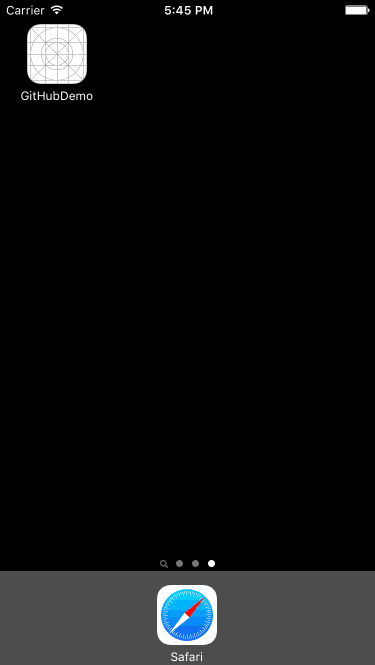

# Introduction

This is a simple app that demonstrates the use of Alamofire and
SwiftJSON for interacting the with GitHub API. It loads everything
inside a TableView but with a second controller (instead of a table
header) to display the organization information.

It also uses two queues (one main, one non-main) to fetch and cache the
images of each member.

# Demo

